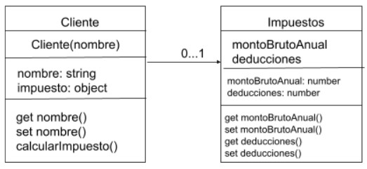

- [CLASES EN ES6](#clases-en-es6)
- [Descripción](#descripción)
  - [Estructura del Proyecto](#estructura-del-proyecto)
  - [Uso](#uso)
  - [Explicación del Código](#explicación-del-código)
      - [Importaciones:](#importaciones)
      - [Creación de Instancias:](#creación-de-instancias)
      - [Cálculo e Impresión del Impuesto:](#cálculo-e-impresión-del-impuesto)
  - [Transpilación con Babel](#transpilación-con-babel)
  - [Dato curioso](#dato-curioso)

# CLASES EN ES6

Desarrolladora : Ana Celeste Pérez

# Descripción
Este proyecto es una aplicación en JavaScript para calcular el impuesto de diferentes clientes basado en su monto bruto anual y sus deducciones. La aplicación incluye dos clases principales: Cliente e Impuesto. Además, utiliza Babel para la transpilación de código ES6+ a una versión compatible con navegadores más antiguos.

## Estructura del Proyecto
El proyecto está compuesto por los siguientes archivos y directorios:

```
- assets/
  -img
  - js/
    - main.js
    - cliente.js
    - impuesto.js
- dist
- node_modules
- babel.config.json
```

-El `main.js` es el archivo principal que utiliza las clases `Cliente` e `Impuestos` para crear instancias y calcular los impuestos e indicar el nombre del cliente.

-El [archivo ](./assets/js/cliente.js) `cliente.js` Contiene la definición de la clase Cliente.  
-El [archivo ](./assets/js/impuesto.js) `impuesto.js` Contiene la definición de la clase Impuesto.

## Uso
Puedes ejecutar el archivo main.js para ver el funcionamiento del proyecto. Usando el siguiente comando en tu terminal:

-`node assets/js/main.js`.

## Explicación del Código

#### Importaciones:

Importamos las clases Cliente e Impuestos desde sus respectivos archivos.  

#### Creación de Instancias:

Creamos instancias de la clase Cliente para dos usuarios diferentes, `cliente1` y `cliente2`.
Creamos instancias de la clase Impuesto para cada cliente con los valores de monto bruto anual y deducciones específicos.  

#### Cálculo e Impresión del Impuesto:

Se Utilizaron los métodos `getNombre()` y `calcularImpuesto()` para obtener el nombre del cliente y calcular el impuesto correspondiente.
Se imprimen estos valores en la consola para cada cliente.

## Transpilación con Babel
Babel es un transpilador de JavaScript que permite utilizar características modernas de JavaScript, como ES6+, en entornos que no las soportan de forma nativa. Este proyecto usa Babel para convertir el código ES6+ a una versión compatible con navegadores más antiguos.

## Dato curioso
-Al colocar un string en donde se instancia
[impuesto1 e impuesto2](./assets/js/main.js#L9), igual me hace el calculo como si fuera un `Number`.


-No pude hacer git add.